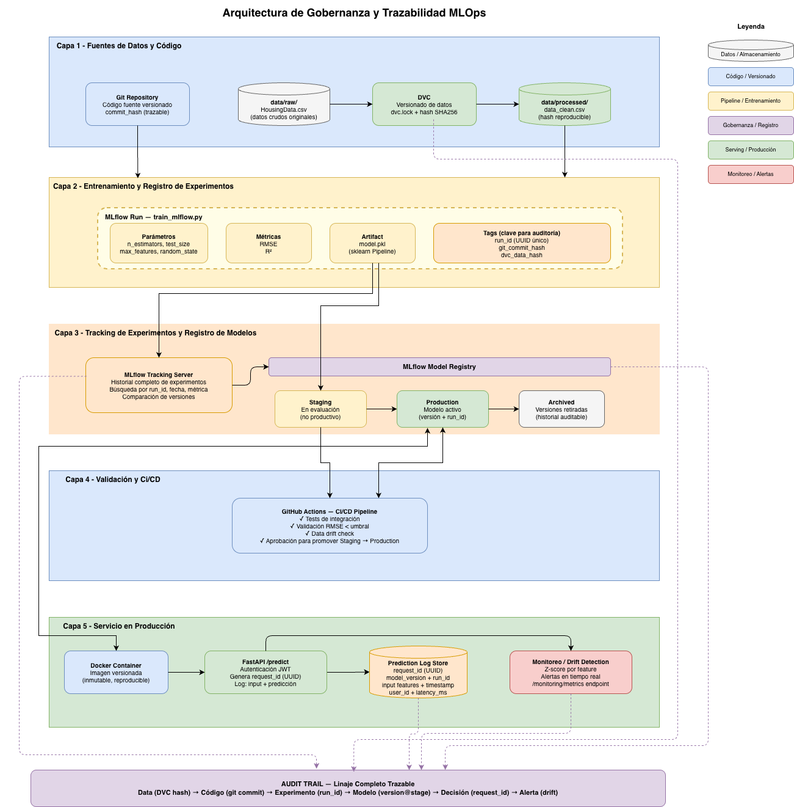

# Boston Housing MLOps Project

## Descripción

Este proyecto implementa un pipeline completo de Machine Learning para la predicción de precios de viviendas, siguiendo buenas prácticas de MLOps.

La solución cubre todo el ciclo de vida del modelo:

* Preparación de datos
* Entrenamiento y evaluación
* Versionado de datos y pipeline
* Tracking de experimentos
* Exposición del modelo mediante API REST
* Containerización con Docker

---

## Problema
Se busca predecir el precio de viviendas en Boston a partir de variables socioeconómicas y estructurales.

Este problema se aborda como un modelo de **aprendizaje supervisado**.

---

## Metodología: CRISP-DM

El proyecto sigue las fases de **CRISP-DM** (Cross-Industry Standard Process for Data Mining) como marco metodológico para estructurar el ciclo de vida del modelo.

| Fase | Descripción | Implementación |
|---|---|---|
| **1. Business Understanding** | Predecir el precio medio de viviendas en Boston a partir de variables socioeconómicas y estructurales, como proxy de un problema de pricing en contextos reales | Definición del problema como regresión supervisada |
| **2. Data Understanding** | Exploración del dataset Boston Housing: análisis de distribuciones, correlaciones, outliers y relación entre features y target (`MEDV`) | `notebooks/01_exploracion_modelo.ipynb` |
| **3. Data Preparation** | Limpieza, transformación y división en train/test. Pipeline reproducible versionado con DVC | `src/preprocess.py` + `dvc.yaml` |
| **4. Modeling** | Entrenamiento de Random Forest con sklearn Pipeline (scaler + modelo). Seleccionado por robustez ante multicolinealidad y relaciones no lineales | `src/train_mlflow.py` |
| **5. Evaluation** | Evaluación con métricas RMSE y R² sobre conjunto de test. Registro de parámetros, métricas y artefactos en MLflow | MLflow Tracking + Model Registry |
| **6. Deployment** | Exposición del modelo como API REST con autenticación JWT. Containerización con Docker y validación continua con GitHub Actions | `app/` + `Dockerfile` + `.github/workflows/ci.yml` |

> CRISP-DM es un proceso iterativo: los resultados de evaluación retroalimentan las fases anteriores (preparación de datos, selección de features, hiperparámetros) hasta alcanzar un modelo satisfactorio para responder la pregunta de negocio.

---

## Arquitectura de la solución

```text
Datos → DVC → Train → MLflow → API → Docker → CI (GitHub Actions)
```

### Componentes de la solución:

* **Git**: versionado de código
* **DVC**: versionado de datos y pipeline reproducible
* **MLflow**: tracking de experimentos y modelos
* **FastAPI**: servicio de inferencia
* **Docker**: portabilidad y despliegue
* **GitHub Actions**: integración continua (CI)

---

## Estructura del proyecto

```text
.
├── app/                     # API FastAPI
│   ├── core/               # Configuración general (logging, monitoreo)
│   ├── main.py             # Punto de entrada de la API
│   ├── routes/             # Definición de endpoints (predict, auth, health)
│   ├── schemas/            # Modelos Pydantic (validación de datos)
│   ├── security/           # Autenticación (JWT, manejo de tokens)
│   └── services/           # Lógica de negocio (inferencia del modelo)
│
├── data/                   # Datos del proyecto
│   ├── raw/                # Datos originales (versionados en git)
│   │   └── HousingData.csv
│   └── processed/          # Datos limpios generados por dvc repro
│
├── src/                    # Scripts de pipeline de ML
│   ├── preprocess.py       # Limpieza y transformación de datos
│   └── train_mlflow.py     # Entrenamiento y registro del modelo
│
├── models/                 # Modelo entrenado (artifact local)
│   └── model.pkl
│
├── notebooks/              # Exploración y análisis (EDA)
│   └── 01_exploracion_modelo.ipynb
│
├── dvc.yaml                # Definición del pipeline (stages)
├── dvc.lock                # Versionado del pipeline (auto-generado)
│
├── Dockerfile              # Contenerización de la aplicación
├── requirements.txt        # Dependencias del proyecto
├── .env                    # Variables de entorno (no versionado)
├── README.md               # Documentación
```

---

## Instalación

### 1. Clonar repositorio

```bash
git clone https://github.com/jmontano1987/mlops-boston-housing-meli.git
cd mlops-boston-housing-meli
```

---

### 2. Crear entorno virtual

```bash
python -m venv .venv
source .venv/bin/activate        # Linux / Mac
.venv\Scripts\activate           # Windows
```

### 3. Instalar dependencias

```bash
pip install -r requirements.txt
```

---

## Pipeline de entrenamiento

Ejecutar el pipeline completo:

```bash
dvc repro
```

Este proceso realiza:

* Carga de datos
* Entrenamiento del modelo
* Evaluación (RMSE, R²)
* Registro en MLflow
* Generación del modelo (`model.pkl`)

---

## Tracking de experimentos

Ejecutar MLflow:

```bash
mlflow ui --port 5000 --host 0.0.0.0  --allowed-hosts "*"  --cors-allowed-origins "*"
```

Abrir en navegador:

```
http://localhost:5000
```

Se pueden visualizar:

* métricas (RMSE, R²)
* parámetros
* modelos entrenados

---

## Variables de entorno

La API se configura mediante variables de entorno cargadas desde un archivo `.env` en la raíz del proyecto.

### Ejemplo de `.env`

```env
MODEL_SOURCE=local
MLFLOW_URI=http://localhost:5000
SECRET_KEY=your_secret_key
ALGORITHM=HS256
ACCESS_TOKEN_EXPIRE_MINUTES=60
CLIENT_ID=your_client_id
CLIENT_SECRET=your_client_secret
```

### Descripción de variables

| Variable | Descripción | Valores / Ejemplo |
|---|---|---|
| `MODEL_SOURCE` | Origen desde donde se carga el modelo | `local`, `mlflow_local`, `mlflow_remote` |
| `MLFLOW_URI` | URL del servidor de MLflow | `http://localhost:5000` |
| `SECRET_KEY` | Clave secreta para firmar tokens JWT | `your_secret_key` |
| `ALGORITHM` | Algoritmo de cifrado para JWT | `HS256` |
| `ACCESS_TOKEN_EXPIRE_MINUTES` | Tiempo de expiración del token (minutos) | `60` |
| `CLIENT_ID` | Identificador del cliente para autenticación | `your_client_id` |
| `CLIENT_SECRET` | Secreto del cliente para autenticación | `your_client_secret` |

> **Nota:** En producción estas variables deben gestionarse de forma segura (por ejemplo, mediante un gestor de secretos como AWS Secrets Manager, HashiCorp Vault o variables de entorno del orquestador). **Nunca** subir el archivo `.env` al repositorio.

---

## API de inferencia

### Ejecutar API

```bash
uvicorn app.main:app --reload
```

La API estará disponible en `http://127.0.0.1:8000`.

### Documentación Swagger

```
http://127.0.0.1:8000/docs
```

---

### Endpoints disponibles

| Método | Endpoint | Descripción | Autenticación |
|---|---|---|---|
| `GET` | `/health` | Verifica el estado del servicio | No |
| `POST` | `/auth/token` | Genera un token JWT usando client_id y client_secret | No |
| `POST` | `/predict` | Realiza una predicción del precio | Sí (JWT) |

---

### 1. Health Check

**`GET /health`**

Verifica que el servicio y el modelo estén correctamente cargados.

#### Response

```json
{
  "status": "ok",
  "model_loaded": true
}
```

---

### 2. Autenticación

La API utiliza **JWT** para proteger los endpoints de inferencia. La autenticación se realiza mediante `client_id` y `client_secret`, configurados como variables de entorno.

#### Obtener token

**`POST /auth/token`**

#### Request

```json
{
  "client_id": "your_client_id",
  "client_secret": "your_client_secret"
}
```

#### Response

```json
{
  "access_token": "eyJhbGciOiJIUzI1NiIsInR5cCI6IkpXVCJ9...",
  "token_type": "bearer"
}
```

#### Usar token

Incluir el token en el header `Authorization` de los endpoints protegidos:

```bash
Authorization: Bearer <access_token>
```

---

### 3. Predicción

**`POST /predict`**

Realiza la predicción del precio medio de una vivienda a partir de sus características.

> **Requiere autenticación JWT.**

#### Request

```json
{
  "CRIM": 0.1,
  "ZN": 18,
  "INDUS": 2.3,
  "CHAS": 0,
  "NOX": 0.5,
  "RM": 6.5,
  "AGE": 65,
  "DIS": 4.2,
  "RAD": 1,
  "TAX": 300,
  "PTRATIO": 15,
  "B": 390,
  "LSTAT": 10
}
```

#### Response

```json
{
  "prediction": 24.37,
  "model_source": "local"
}
```

#### Ejemplo con `curl`

```bash
curl -X POST "http://127.0.0.1:8000/predict" \
  -H "Authorization: Bearer <access_token>" \
  -H "Content-Type: application/json" \
  -d '{
    "CRIM": 0.1, "ZN": 18, "INDUS": 2.3, "CHAS": 0,
    "NOX": 0.5, "RM": 6.5, "AGE": 65, "DIS": 4.2,
    "RAD": 1, "TAX": 300, "PTRATIO": 15, "B": 390, "LSTAT": 10
  }'
```

---

## CI/CD con GitHub Actions

El proyecto incluye un pipeline de integración continua configurado en [.github/workflows/ci.yml](.github/workflows/ci.yml) que se ejecuta automáticamente en cada push a `main` y en Pull Requests.

### Flujo del pipeline

```text
Checkout → Setup Python 3.12 → Install deps → Test API import → Test model loading → Lint
```

### Pasos del pipeline

| Paso | Descripción |
|---|---|
| **Checkout** | Descarga el código del repositorio |
| **Setup Python 3.12** | Configura el entorno de Python |
| **Install dependencies** | Instala todo desde `requirements.txt` |
| **Test API import** | Valida que `app.main` importa correctamente |
| **Test model loading** | Verifica que el `model_service` carga sin errores |
| **Lint (flake8)** | Análisis estático del código (no bloquea el pipeline) |

### Variables de entorno en CI

El pipeline utiliza `MODEL_SOURCE=none` para deshabilitar la carga real del modelo en el entorno de CI, y `SECRET_KEY` se define directamente en el workflow para evitar dependencias de secretos externos.

---

## Docker

### Construir imagen

```bash
docker build -t housing-api .
```

---

### Ejecutar contenedor

Ejecución simple (usando variables por defecto):

```bash
docker run -p 8000:8000 housing-api
```

Ejecución pasando variables de entorno:

```bash
docker run -p 8000:8000 \
  -e SECRET_KEY=<tu_secret_key> \
  -e MODEL_SOURCE=local \
  -e ALGORITHM=HS256 \
  -e ACCESS_TOKEN_EXPIRE_MINUTES=60 \
  -e CLIENT_ID=<tu_client_id> \
  -e CLIENT_SECRET=<tu_client_secret> \
  housing-api
```

Ejecución usando un archivo `.env` (recomendado):

```bash
docker run -p 8000:8000 --env-file .env housing-api
```

### Probar autenticación con Docker

Una vez levantado el contenedor, obtener el token:

```bash
curl -X POST http://localhost:8000/auth/token \
  -H "Content-Type: application/json" \
  -d '{"client_id": "your_client_id", "client_secret": "your_client_secret"}'
```

Usar el token para predecir:

```bash
curl -X POST http://localhost:8000/predict \
  -H "Authorization: Bearer <access_token>" \
  -H "Content-Type: application/json" \
  -d '{
    "CRIM": 0.1, "ZN": 18, "INDUS": 2.3, "CHAS": 0,
    "NOX": 0.5, "RM": 6.5, "AGE": 65, "DIS": 4.2,
    "RAD": 1, "TAX": 300, "PTRATIO": 15, "B": 390, "LSTAT": 10
  }'
```

> **Nota:** Generá valores seguros para `CLIENT_ID` y `CLIENT_SECRET` con `python -c "import secrets; print(secrets.token_urlsafe(32))"`. Nunca uses valores por defecto en producción.

---

## Decisiones técnicas

* **Random Forest**: seleccionado por su capacidad de capturar relaciones no lineales y robustez ante multicolinealidad.
* **DVC**: utilizado para versionar datos y definir un pipeline reproducible.
* **MLflow**: permite trazabilidad de experimentos y modelos.
* **FastAPI**: elegido por su rendimiento y facilidad de uso para la implementación.
* **Docker**: garantiza portabilidad y despliegue independiente del entorno.
* **JWT**: autenticación stateless mediante client_id/client_secret para proteger los endpoints de inferencia.

---

## Reproducibilidad

El sistema permite reconstruir cualquier versión del modelo mediante:

```bash
git checkout <commit>
dvc pull
dvc repro
```

Esto asegura:

* mismo dataset
* mismo código
* mismo modelo

---

## Buenas prácticas implementadas

* Exclusión de artefactos (`mlruns`, `models`, `.env`) del repositorio
* Separación entre código productivo y exploración
* Validación de entrada con Pydantic
* Arquitectura desacoplada (routes, services, schemas)
* Configuración mediante variables de entorno (12-factor app)
* Autenticación JWT en endpoints sensibles
* Pipeline de CI con GitHub Actions (validación de imports, carga del modelo y lint)

---

## Mejoras futuras

* Model Registry con MLflow
* Monitoreo de drift
* CD (Continuous Deployment) con GitHub Actions
* Feature Store
* Reentrenamiento automático

---

## Conclusión

La solución implementa un pipeline MLOps completo que garantiza:

* Reproducibilidad
* Trazabilidad
* Portabilidad

permitiendo escalar el modelo a entornos productivos de manera eficiente.

---

## Bonus Track: Reproducibilidad y Trazabilidad de Modelos

> **Nota:** Esta sección responde analíticamente a los requerimientos de trazabilidad y gobernanza para la auditoría del ciclo de vida de modelos. El diagrama de arquitectura se encuentra en `docs/gobernanza_trazabilidad.png`.

### Arquitectura del Sistema



El diagrama presenta una arquitectura MLOps de referencia que integra versionado de datos, tracking de experimentos, registro de modelos, validación y servicio de inferencia en producción.

En la implementación actual se desarrollaron los componentes base, incluyendo:
- Versionado de datos con DVC.
- Tracking de experimentos con MLflow (parámetros, métricas y artefactos).
- Servicio de inferencia mediante FastAPI con autenticación.
- Monitoreo en tiempo de inferencia con logging, latencia y detección de drift.

Adicionalmente, la arquitectura deja preparado el flujo para incorporar capacidades avanzadas de gobernanza, tales como:
- Validación automática de modelos en CI/CD.
- Promoción controlada de versiones en el Model Registry.
- Trazabilidad completa desde datos y código hasta predicciones en producción.

---

### 1. Análisis del Problema y Riesgos

La incapacidad de proveer trazabilidad y evidencia ante una auditoría expone a la empresa a riesgos en cuatro dimensiones críticas:

#### Riesgos de Confianza

Sin trazabilidad, la empresa no puede responder a la pregunta fundamental que se surge en una auditoría: **¿qué modelo tomó qué decisión, cuándo la tomo, con qué datos y bajo qué condiciones?** Esto carencia de información destruye la confianza completa de reguladores, auditores internos y clientes. 

En contextos de negocio como es el caso de MercadoLibre, donde los modelos pueden influir en procesos como el scoring crediticio, la detección de fraude o el pricing dinámico,  la ausencia de este tipo de evidencia equivale a operar como una "caja negra" sin responsabilidad trazable y sin capacidad de demostrar cómo funcionan los modelos ni cómo se alinean sus respuestas a las necesidad de negocio para las cuales fueron diseñados.

#### Riesgos Operativos

En entornos criticos como es el caso de Mercado Libre, donde los modelos de machine learning están integrados en procesos críticos de negocio, la operación no se limita solamente a obtener buenas métricas de desempeño. Es necesario poder garantizar control, auditabilidad y capacidad de gestión sobre todo el ciclo de vida del modelo: desde el entrenamiento hasta su comportamiento en producción.

La ausencia de buenas prácticas como versionamiento, trazabilidad y registro de experimentos no solo impacta la calidad técnica, sino que introduce vulnerabilidades operativas que pueden afectar directamente la continuidad del negocio, la confianza en los sistemas y la capacidad de respuesta ante incidentes. Estas debilidades también pueden trasladarse a la percepción del usuario, afectando la lealtad hacia la marca, ya que la entrega de información de baja calidad deriva en resultados negativos para el negocio.

Bajo este contexto, se identifican los siguientes riesgos operativos:

- **Imposibilidad de rollback controlado**: si un modelo en producción genera predicciones degradadas y no hay registro versionado de cuál versión está activa ni con qué datos fue entrenada, revertir a una versión anterior se convierte en una operación arriesgada, manual y demorada.
- **Incapacidad de reproducir resultados**: si no se cuenta con un registro claro de cómo se entrenó y ejecutó un modelo, los resultados no pueden replicarse ni validarse. Esto impide corregir errores y genera incertidumbre sobre la confiabilidad de la información entregada por los modelos.
- **Falta de transparencia en decisiones individuales**: cuando no existe un mecanismo que nos permita tener trazabilidad, no es posible identificar con precisión qué modelo tomó una decisión específica en un momento dado. Ante preguntas como “¿con qué modelo se tomó esta decisión el día X?”, no hay una respuesta clara, lo que dificulta la auditoría y la generación de confianza.

#### Riesgos Regulatorios

En Latinoamérica y a nivel global existen marcos regulatorios que exigen explicabilidad y trazabilidad en decisiones automatizadas, especialmente cuando estas impactan directamente a personas o procesos críticos del negocio.

En este contexto, las organizaciones deben ser capaces de auditar, revisar y justificar cómo se toman las decisiones: qué modelo intervino, con qué información y bajo qué criterios. La falta de estas capacidades limita la posibilidad de responder adecuadamente ante requerimientos de entidades de control y debilita la confianza en los procesos internos.

En sectores como el financiero, donde los modelos pueden influir en decisiones de crédito, pagos o detección de fraude, se espera que estos estén documentados, versionados y sean reproducibles. No contar con estas prácticas expone a la organización a riesgos relevantes.

El incumplimiento puede derivar en sanciones, restricciones operativas y pérdida de licencias en mercados clave, afectando directamente la continuidad del negocio.

#### Riesgos Reputacionales

Una auditoría fallida que expone gobernanza deficiente tiene alto impacto en prensa financiera y tecnológica. Para una empresa de la escala de MercadoLibre, con cotización pública y millones de usuarios, la percepción de operar modelos sin control puede traducirse en caída de evaluación, pérdida de clientes y demandas colectivas si se demuestra sesgo o trato injusto en decisiones automatizadas o controladas.

---

### 2. Propuesta de Solución General

A partir de los riesgos identificados, se hace evidente la necesidad de implementar un enfoque estructurado que permita garantizar trazabilidad, control y gobierno sobre todo el ciclo de vida de los modelos.

Para ello, la solución debe asegurar que cada modelo en producción cuente con evidencia completa de su origen, incluyendo el código con el que fue construido, los datos utilizados, las condiciones de entrenamiento y su comportamiento en operación. Asimismo, debe permitir rastrear cada predicción hasta la versión exacta del modelo que la generó.

La solución propuesta se articula en torno a cuatro pilares que, en conjunto, garantizan **linaje completo del proceso** desde el dato crudo hasta cada predicción individual en producción.

#### Pilar 1 — Linaje de Datos (DVC)

Se utiliza DVC que actúa como el control de versiones de los datos, de manera análoga a como Git versiona el código. Con DVC se almacena el hash de cada dataset y cada etapa del pipeline. Asociado a un commit de Git, este hash forma una referencia inmutable: dado un commit, se puede reconstruir exactamente el estado de los datos de entrenamiento en cualquier punto del tiempo.

```
git checkout <commit>  →  dvc pull  →  dvc repro
```

Esto es suficiente para responder ante auditoría: "este modelo fue entrenado con exactamente estos datos".

#### Pilar 2 — Registro de Experimentos (MLflow Tracking)

Cada ejecución de entrenamiento se registra en MLflow:

- **Parámetros**: hiperparámetros del modelo (n_estimators, test_size, random_state).
- **Métricas**: RMSE y R² calculados sobre el conjunto de evaluación.
- **Artifacts**: el modelo serializado (`model.pkl`) con su `sklearn Pipeline` completo (scaler + modelo).
- **Tags**: el elemento diferenciador en términos de gobernanza. Se propone enriquecer cada run con tags de `git_commit_hash` y `dvc_data_hash`, creando así el triplete de trazabilidad completo.

El servidor de tracking de MLflow mantiene el historial completo y permite comparación, búsqueda y reproducción de cualquier experimento por `run_id`.

#### Pilar 3 — Gobierno de Modelos (MLflow Model Registry con Stages)

El Model Registry se implementó en el proyecto utilizando el mecanismo de Tags (`Staging → Production → Archived`) y se convierte en el núcleo de gobernanza:

- **Staging**: todo modelo entrenado aterriza aquí. Nunca va directo a producción.
- **Production**: solo alcanzable tras superar el gate de validación (Pilar 4). Registra quién aprobó la promoción y cuándo.
- **Archived**: los modelos retirados de producción no se eliminan. Quedan disponibles para auditoría histórica indefinidamente. Cada versión archived mantiene referencia al `run_id` y por tanto al dataset y código con el que fue construida.

El flujo propuesto garantiza que **ningún modelo llega a producción sin evidencia asociada y aprobación explícita**.

#### Pilar 4 — Validación y Gate de Calidad (CI/CD)

Se implementó un pipeline de GitHub Actions como mecanismo de validación automática del sistema. 
Por motivos de seguridad y desacoplamiento (no exponer artefactos del modelo ni depender de un registry externo en CI), el pipeline no carga el modelo real durante la ejecución.

En su lugar, se configuró un modo de ejecución controlado (`MODEL_SOURCE=none`) que permite validar:

1. **Integridad de la API**: la aplicación levanta correctamente y no presenta errores de importación o configuración.
2. **Consistencia del entorno**: instalación reproducible de dependencias.
3. **Estructura del sistema**: inicialización de componentes principales sin depender de artefactos externos.

Este enfoque simula el comportamiento de un pipeline de calidad real, manteniendo el desacoplamiento de artefactos en CI. 
La arquitectura está preparada para evolucionar hacia un gate completo que incluya:
- comparación automática de métricas (e.g., RMSE) entre versiones,
- promoción de modelos en MLflow Registry,
- validaciones de drift en datos de entrenamiento.

#### Pilar 5 — Trazabilidad en Producción (Enriched Logging)

El endpoint `/predict` implementa trazabilidad en tiempo de inferencia mediante la generación de un `request_id` único y el registro de información relevante de cada solicitud, incluyendo los datos de entrada, la predicción generada y métricas de ejecución.

Actualmente, el sistema captura los siguientes elementos:

| Campo | Descripción |
|---|---|
| `request_id` | UUID único por solicitud (implementado) |
| `input_features` | Vector de entrada completo (implementado) |
| `prediction` | Valor predicho por el modelo (implementado) |
| `latency_ms` | Latencia de inferencia por solicitud (implementado) |
| `drift_alerts` | Alertas de drift detectadas en el request (implementado) |

Esta información permite realizar seguimiento detallado de cada predicción y facilita el monitoreo del comportamiento del modelo en producción.

Adicionalmente, la arquitectura está preparada para evolucionar hacia un esquema de trazabilidad completa que incluya:

| Campo | Descripción |
|---|---|
| `model_version` | Versión del modelo activo en el registry |
| `run_id` | ID del run de MLflow que generó el modelo |
| `model_stage` | Stage del modelo al momento de la predicción |
| `user_id` | Identidad del solicitante (extraída del JWT) |

Con esta evolución, sería posible responder preguntas de auditoría como: *“¿qué modelo tomó esta decisión, con qué datos fue entrenado, quién realizó la solicitud y si existían alertas de drift en ese momento?”*.

---

### Por Qué Esta Aproximación Es la Más Adecuada

Esta aproximación permite garantizar trazabilidad de extremo a extremo, asegurando que cada modelo pueda ser reconstruido, auditado y explicado en cualquier momento. Además, establece un esquema claro de control sobre versiones, validaciones y despliegues, manteniendo consistencia a lo largo de todo el ciclo de vida del modelo.

Su valor se fundamenta en tres capacidades clave: escalabilidad, reproducibilidad y gobernanza.

#### Escalabilidad

MLflow y DVC son agnósticos al proveedor de infraestructura. El backend de MLflow puede migrar de almacenamiento local (file:./mlruns) a bases de datos relacionales (PostgreSQL) con almacenamiento de artifacts en S3, GCS o Azure Blob, sin cambiar la interfaz de programación. El Model Registry escala para gestionar cientos de modelos y miles de versiones con la misma API. DVC soporta backends remotos (S3, GCS, Azure, SSH) para equipos distribuidos.

#### Reproducibilidad

La combinación git_commit_hash + dvc_data_hash + mlflow_run_id forma un triplete que identifica inequívocamente el estado completo del sistema en cualquier momento histórico: el código que generó el modelo, los datos exactos con los que fue entrenado, y los hiperparámetros y métricas registradas. Cualquier versión de cualquier modelo puede ser reconstruida determinísticamente.

#### Gobernanza

El flujo forzado Staging → validación CI/CD → Production → Archived implementa una cadena de custodia auditable. Cada transición queda registrada con metadatos de tiempo y aprobación. La inmutabilidad del archive garantiza que la evidencia histórica no puede ser borrada accidentalmente. La combinación con logs de predicción enriquecidos cierra el ciclo: el linaje va desde el dato crudo hasta cada decisión individual en producción.

Este diseño está alineado con buenas prácticas de gobierno de modelos, adaptado a entornos de experimentación continua donde múltiples versiones coexisten y evolucionan en el tiempo.

---